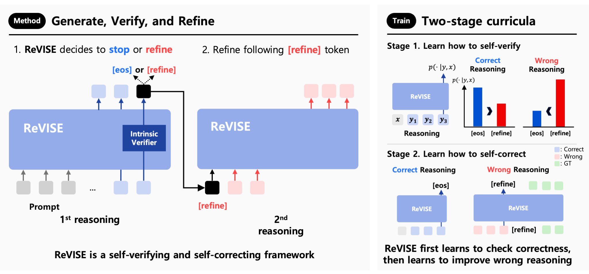

<h1 align="center">[ICML 2025] ReVISE: Learning to Refine at Test-Time <br>via Intrinsic Self-Verification
</h1>

<div align="center">
  <a href="https://hyunseoklee-ai.github.io/" target="_blank">Hyunseok&nbsp;Lee</a><sup>*1</sup> &ensp; <b>&middot;</b> &ensp;
  <a href="https://seunghyukoh.com" target="_blank">Seunghyuk&nbsp;Oh</a><sup>*1</sup> &ensp; <b>&middot;</b> &ensp;
  <a href="https://sites.google.com/view/jaehyungkim" target="_blank">Jaehyung&nbsp;Kim</a><sup>2</sup>
  <br>
  <a href="https://alinlab.kaist.ac.kr/shin.html" target="_blank">Jinwoo&nbsp;Shin</a><sup>1</sup> &ensp; <b>&middot;</b> &ensp;
  <a href="https://jihoontack.github.io/" target="_blank">Jihoon&nbsp;Tack</a><sup>1</sup> &ensp;
  <br>
  <br>
  <sup>1</sup> KAIST &emsp; <sup>2</sup>Yonsei University &emsp; <br>
  <sup>*</sup>Equal Contribution &emsp; <br>
</div>

<p align="center">
  <a href="https://icml.cc/virtual/2025/poster/44699">
    
  </a>
  <a href="https://arxiv.org/abs/2502.14565">
    
  </a>
</p>

<p align="center">
  
</p>

**Summary:** We propose **Re**fine **V**ia **I**ntrinsic **SE**lf-Verification (ReVISE), a method that allows LLMs to check and improve their own reasoning during inference **without external feedback or more supervision.** ReVISE trains the model to spot when its reasoning might be unreliable and decide whether to keep going or change its answer. It uses **a two-stage training process** and decoding that is aware of confidence levels to guide these decisions.

## Updates

**2025.8.11**: First code release

## Installation

### 1. Clone the repository

```bash
git clone https://github.com/seunghyukoh/revise.git
cd revise
```

### 2. Set up your Python environment

You can use `Conda` to set up your environment.

#### Using Conda

````bash
conda env create -f environment.yaml
conda activate revise

# Install flash-attn
pip install flash-attn==2.7.3 --no-build-isolation
````

## How to Run ReVISE

### 1. Setup Environment Variables

First, copy the example environment file and update it with your configurations.

```bash
cp .env.example .env
```

Now, open the `.env` file and add your configurations. This might include API keys for models like GPT-4, or paths to local model weights.

```bash
# .env
# Example content
HUB_USER_ID="<Huggingface User ID>"
TEMP_PATH="./.tmp" # where model checkpoints are saved
WANDB_PROJECT_NAME=revise
```

### 2. Run the Main Script

The `scripts/revise.sh` script handles the main execution pipeline.

```bash
bash scripts/revise.sh
```

**What does this script do?**
This script runs the ReVISE inference process on the GSM8K benchmark by default. You can modify the script to change parameters such as the model, dataset, or output directory.

## BibTeX

```bibtex
@article{lee2025revise,
  title={ReVISE: Learning to Refine at Test-Time via Intrinsic Self-Verification},
  author={Lee, Hyunseok and Oh, Seunghyuk and Kim, Jaehyung and Shin, Jinwoo and Tack, Jihoon},
  journal={arXiv preprint arXiv:2502.14565},
  year={2025}
}
```
